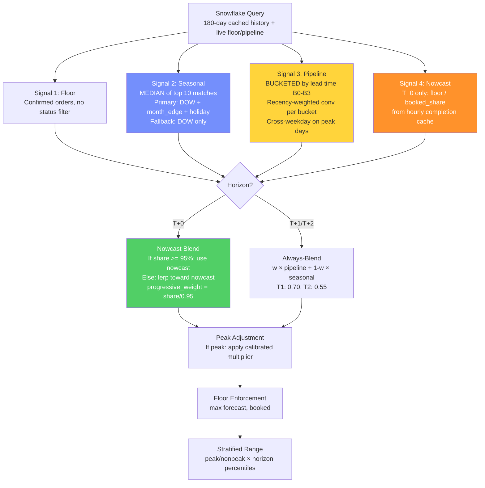

# Hybrid Order Forecast — Architecture & Implementation Plan

**Date:** 2026-04-03
**Author:** AI Architect (Lead Data Scientist)
**Success Metric:** Backtest MAPE < 12% for March 20 – April 03 (2025 & 2026), T+0 at 9 AM IST
**Repo:** [pnm-order-forecast-hybrid](https://github.com/akshayjain00/pnm-order-forecast-hybrid)
**Backtest Hours:** 9 AM IST, 3 PM IST
**Status:** Architecture finalized, pending implementation

---

## 1. Hybrid Architecture Rationale

### The Problem

Our two models have complementary strengths that, when isolated, each produce suboptimal forecasts during the critical month-end peak window (March 20 – April 03):

| Model | T+0 9AM MAPE (Mar 15-31, 2026) | Root Cause of Weakness |
|-------|-------------------------------|----------------------|
| **V4** | 24.0% | Conservative `min(pipeline, seasonal)` degrades to floor-only output when pipeline data is incomplete at 9 AM |
| **V2** | 10.4% | Unbucketed pipeline treats all opportunity lead times equally; T+2 weight (0.20) makes longer horizons seasonal-dominated |

### Why a Hybrid Outperforms Both

The hybrid combines **V2's forecasting intelligence** with **V4's data infrastructure**:

```
V2's Brain (HOW to forecast)          V4's Body (WHAT data to use)
├─ Nowcast: floor/booked_share        ├─ 4 lead-time buckets (B0-B3)
├─ Always-blend (never clip to floor) ├─ Recency-weighted conversion
├─ Median seasonal matching           ├─ Stratified prediction ranges
├─ Tiered matching (primary+fallback) ├─ Narrow peak definition
└─ 180-day deep history               └─ Production CI/CD stack
```

### Step-by-Step Reasoning (Chain of Thought)

**Step 1 — Diagnose T+0 failure mode:**
At 9 AM IST, ~70-80% of the day's orders are already booked (floor). The remaining 20-30% will arrive throughout the day. V4 sees `pipeline_total ≈ floor` (since most opps at T+0 have already converted), then applies `min(floor, seasonal)` = floor. It throws away the seasonal signal entirely. V2 avoids this by: (a) computing `nowcast = floor / booked_share` to project the full day, and (b) always blending pipeline + seasonal, never clipping.

**Step 2 — Diagnose peak period failure:**
March 20-31 contains the month-end surge (last 2-3 days see 2-3x normal volume). During this period:
- V4's volume matching (±10-20%) fails because peak-day B0 opps (5,217) exceed any historical same-weekday match (max 3,011). All conversion rates fall to 0.10 default.
- V2's broader matching (DOW + `is_month_edge`) finds more matches but still uses a single unbucketed conversion.
- **Hybrid fix:** Use V4's bucketed pipeline but with V2's cross-weekday matching on peak days (already fixed in SQL) PLUS V2's 180-day lookback for deeper match pool.

**Step 3 — Evaluate blending strategy:**
V4's conservative `min()` was tuned on full-day backtests (pipeline is complete). At 9 AM, pipeline is 70-80% complete — the missing 20-30% is precisely what the seasonal signal captures. Always-blend ensures seasonal contributes proportionally.

**Step 4 — Design nowcast integration:**
V2's nowcast (`floor / booked_share`) is the single highest-ROI feature. At 9 AM with 75% of orders booked, nowcast projects `floor / 0.75` — typically within 5-8% of actual. The progressive blending (`lerp` toward nowcast as `booked_share` → 95%) avoids over-reliance on a single signal early in the day.

**Step 5 — Handle T+1/T+2 separately:**
V2's T+2 weight (0.20) makes it almost purely seasonal at 2-day horizons. V4's bucketed pipeline with 0.55 weight is better for T+2 because lead-time bucket B2/B3 opps are informative at longer horizons. Keep V4's horizon weights for T+1/T+2.

### Decision Flow — Hybrid



---

## 2. Repository Structure

The hybrid model will be built as an evolution of the V4 repository (which has the production infrastructure), incorporating V2's algorithmic improvements.

```
pnm-order-forecast-hybrid/
├── .github/
│   └── workflows/
│       ├── test.yml                     # ★ Lint + unit tests on every PR
│       └── hourly_forecast.yml          # Hourly CI/CD (from V4, future)
│
├── config/
│   └── holiday_calendar.csv             # Holiday + special dates
│
├── docs/
│   ├── HYBRID_ARCHITECTURE.md           # This document
│   ├── V2_VS_V4_COMPARISON.md           # Prior analysis
│   └── V2_ORDER_FORECAST_WALKTHROUGH.md # Stakeholder guide
│
├── sql/
│   ├── forecast_snapshot.sql            # ★ Unified snapshot query (hybrid)
│   ├── cache_historical_daily.sql       # ★ Cache: daily signals (180 days)
│   ├── cache_hourly_completion.sql      # ★ Cache: hourly booked_share
│   ├── backtest_actuals.sql             # Actuals for backtest validation
│   └── calendar_features.sql            # Calendar feature extraction
│
├── src/
│   ├── __init__.py
│   ├── cli.py                           # ★ CLI: forecast, backtest, compare, validate
│   ├── config.py                        # ★ Hybrid parameters + peak definition
│   ├── forecast.py                      # ★ Hybrid blending engine (always-blend + nowcast)
│   ├── backtest.py                      # ★ Peak-window backtest + model comparison
│   ├── snowflake_runner.py              # Snowflake connection (from V4)
│   ├── cache_manager.py                 # ★ Cache refresh + staleness checks
│   ├── data_quality.py                  # ★ DQ gates (from V4, extended)
│   ├── logger.py                        # Structured logging (from V4)
│   └── calibrate_ranges.py             # Stratified range calibration (from V4)
│
├── scripts/
│   └── check_regression.py              # ★ CI gate: fail if MAPE > threshold
│
├── tests/
│   ├── conftest.py                      # ★ Shared fixtures (sample signals, params)
│   ├── test_forecast.py                 # ★ 20+ unit tests for hybrid blending
│   ├── test_nowcast.py                  # ★ Nowcast edge cases + progressive blend
│   ├── test_properties.py              # ★ Property-based tests (hypothesis)
│   ├── test_config.py                   # ★ Parameter validation
│   ├── test_range.py                    # Range computation tests
│   ├── test_data_quality.py            # ★ DQ gate validation
│   └── test_integration.py             # ★ Snowflake integration (marked slow)
│
├── output/
│   └── backtest_reports/                # Generated backtest CSVs
│
├── pyproject.toml                       # ★ ruff, mypy, pytest, sqlfluff config
├── .sqlfluff                            # ★ SQL linting config (Snowflake dialect)
├── requirements.txt
└── README.md
```

### Key Files: What Changes and Why

| File | Source | Change | Rationale |
|------|--------|--------|-----------|
| `sql/forecast_snapshot.sql` | **V2** (rewritten) | Merge V2's minute-level snapshot approach with V4's bucketed pipeline | V2's snapshot approach gives accurate as-of pipeline + nowcast data; V4's buckets give lead-time granularity |
| `src/forecast.py` | **New** (hybrid) | Combine V2's `compute_point_estimate` + `apply_d0_nowcast` with V4's `compute_pipeline_estimate` | Core blending engine |
| `src/config.py` | **V4** (modified) | Add V2's horizon weights for T+0 (0.80), extend history to 180 days, add nowcast params | Parameter unification |
| `src/backtest.py` | **V4** (modified) | Add multi-hour support, peak-window focused evaluation | Validate specifically on Mar 20 – Apr 03 |

---

## 3. Core Algorithms

### 3.1 Signal Computation

#### Signal 1: Floor (unchanged from V2/V4)
```python
floor = count(DISTINCT orders WHERE service_date = target AND created_at < cutoff)
```

#### Signal 2: Seasonal Baseline (V2's approach)
```python
# Primary tier: DOW + is_month_edge + holiday_phase (MEDIAN of top 10)
# Fallback tier: DOW only (MEDIAN of top 10)
# History: 180 days
seasonal = COALESCE(primary_median, fallback_median, 0)
```
**Why V2 over V4:** V2's median is robust to outliers. V4's mean (80% × 10wk_avg + 20% × 12mo_avg) is dragged by extreme days. V2's tiered matching (primary + fallback) ensures matches are always found.

#### Signal 3: Pipeline (V4's buckets + V2's matching depth)
```python
# 4 buckets: B0 (0-1d), B1 (2-3d), B2 (4-7d), B3 (8+d)
# Conversion: recency-weighted average per bucket (from V4)
# Matching: 180-day lookback (from V2), cross-weekday on peak days
# Volume filter: ±20% (from V2's broader tolerance)
pipeline_estimate = sum(bucket_opps[i] * conv_rate[i] for i in range(4))
```

#### Signal 4: Nowcast (from V2, T+0 only)
```python
# booked_share = MEDIAN(historical_booked_orders_at_cutoff / final_orders)
# Matched on: DOW + holiday_phase, top 12 recency-sorted matches
nowcast = floor / booked_share  # Projects partial-day floor to full day
```

### 3.2 Blending Engine

```python
def compute_hybrid_estimate(
    floor: int,
    pipeline_estimate: float,       # From bucketed pipeline
    seasonal_baseline: float,       # From median matching
    horizon: int,
    pipeline_opp_count: int,
    is_peak: bool,
    booked_orders: int | None,      # T+0 only
    booked_share: float | None,     # T+0 only
    params: HybridParams,
) -> float:
    """Hybrid blending: V2 brain + V4 body.

    Key differences from V4:
    1. NEVER uses min(pipeline, seasonal) — always blends
    2. Adds nowcast for T+0
    3. Uses V2's higher T+0 weight (0.80 vs 0.70)

    Key differences from V2:
    1. Uses bucketed pipeline (4 buckets) instead of single conversion
    2. Uses V4's T+2 weight (0.55 vs 0.20) — pipeline is informative at T+2
    3. Applies stratified ranges (peak/nonpeak × horizon)
    """

    # Step 1: Pipeline floor enforcement (from V4)
    pipeline_total = max(float(floor), pipeline_estimate)

    # Step 2: Determine effective weight
    if pipeline_opp_count < params.min_pipeline_opps:
        effective_weight = params.sparse_pipeline_weight
    else:
        effective_weight = params.horizon_weights[horizon]

    # Step 3: ALWAYS blend — never clip (key V2 insight)
    blend = effective_weight * pipeline_total + (1 - effective_weight) * seasonal_baseline

    # Step 4: Nowcast for T+0 (from V2) — BEFORE peak adjustment
    # (Nowcast projects full-day volume; peak multiplier then scales it)
    if horizon == 0 and booked_orders is not None and booked_share is not None:
        # Clamp booked_share to (0, 1] to guard against data quality issues
        clamped_share = max(min(booked_share, 1.0), 0.01)
        nowcast = max(booked_orders / clamped_share, float(booked_orders))

        if clamped_share >= params.full_switch_share:
            # High confidence: use nowcast directly
            blend = nowcast
        else:
            # Progressive: lerp toward nowcast as more orders arrive
            nowcast_weight = clamped_share / params.full_switch_share
            blend = nowcast_weight * nowcast + (1 - nowcast_weight) * blend

    # Step 5: Peak adjustment — AFTER nowcast so peak multiplier
    # scales the blended/nowcast estimate consistently
    if is_peak:
        blend *= min(params.peak_multiplier, params.peak_multiplier_cap)

    # Step 6: Floor enforcement
    return max(blend, float(floor))
```

### 3.3 Key Behavioral Notes

**Nowcast is T+0 only (by design):** For T+1/T+2, `booked_orders_so_far` represents orders booked for *future* dates — this is much sparser and less predictive than T+0's floor (which is >70% of actuals). The pipeline signal is the better predictor for T+1/T+2.

**3 PM vs 9 AM behavior:** At 3 PM, `booked_share ≈ 0.92-0.95`, so `nowcast_weight = 0.92/0.95 = 0.97`. The nowcast dominates — this is correct because the floor at 3 PM is the strongest signal available. At 9 AM, `booked_share ≈ 0.70-0.80`, so the blend contributes more.

**Peak multiplier is a preserved hook (currently 1.0):** Both V2 and V4 disabled the peak multiplier because the seasonal signal already matches peak-to-peak (median of `is_month_edge` days). Enabling the multiplier would double-count. Kept as a tunable hook for future use if seasonal matching changes.

**Two peak definitions, two purposes:**
- `is_month_edge` (broader: day ≤ 3 OR days_to_end ≤ 2) — used for **seasonal matching** to find historically similar days
- `is_peak_date` (narrower: last 2 days of month + first 1 day) — used for **blending behavior** (peak vs non-peak path), **range stratification**, and **conversion rate matching** (drop weekday constraint)

**Output versioning:** Every forecast run writes a `run_metadata.json` with: git SHA, parameter hash, eval_date, cutoff_ts, cache_freshness_check. This enables debugging any historical forecast.

### 3.4 Hybrid Parameters

```python
HYBRID_PARAMS = {
    # --- From V2 ---
    "horizon_weight_T0": 0.80,          # V2's higher T+0 trust (vs V4's 0.70)
    "full_switch_share": 0.95,          # Nowcast full-switch threshold
    "sparse_pipeline_weight": 0.20,     # Fallback when opps < min
    "history_lookback_days": 180,       # V2's deeper history (vs V4's 56 days)

    # --- From V4 ---
    "horizon_weight_T1": 0.70,          # V4's T+1 weight (same as V2)
    "horizon_weight_T2": 0.55,          # V4's T+2 weight (vs V2's 0.20)
    "bucket_boundaries": [0, 2, 4, 8],  # B0, B1, B2, B3
    "opp_volume_lower_pct": 0.80,       # Wider tolerance (V2-inspired)
    "opp_volume_upper_pct": 1.20,       # Wider tolerance

    # --- Peak handling (hybrid-specific) ---
    # Data-driven: last 2 days of month + first 1 day of next month
    # Apr 1 shows 1.9-2.2x normal (spillover effect), Apr 2-3 returns to normal
    "peak_definition": "month_boundary",  # last 2 days + first 1 day
    "peak_multiplier_cap": 1.0,           # Disabled (both models agree)
    "peak_drop_weekday_constraint": True, # Cross-weekday matching on peak

    # --- Hybrid-specific ---
    "conservative_nonpeak": False,        # ★ DISABLED — always blend
    "min_pipeline_opps": 5,
    "seasonal_match_method": "median",    # V2's median (vs V4's mean)
    "seasonal_match_tiers": ["primary", "fallback"],  # V2's tiered
    "seasonal_top_k": 10,                 # Top 10 matches
    "pipeline_top_k": 12,                 # Top 12 conversion matches
    "nowcast_horizons": [0],              # T+0 only

    # --- Stratified ranges (from V4, recalibrated) ---
    "range_target_coverage": 0.65,
    # Will be recalibrated after hybrid backtest
}
```

---

## 4. SQL Design: Unified Forecast Snapshot

The most critical file is `sql/forecast_snapshot.sql`. It must produce a single row per `(target_date, horizon)` containing all signals needed by the Python blending engine.

### Output Schema

| Column | Type | Source | Description |
|--------|------|--------|-------------|
| `target_date` | DATE | Both | Service date being forecast |
| `horizon` | INT | Both | 0, 1, or 2 days ahead |
| `cutoff_ts_ist` | TIMESTAMP | V2 | Exact as-of cutoff time |
| `cutoff_hour_ist` | INT | V2 | Hour component (0-23) |
| `floor_orders` | INT | Both | Confirmed orders at cutoff |
| `open_opps_b0..b3` | INT | V4 | Pipeline opps per lead-time bucket |
| `total_open_opps` | INT | V4 | Sum across buckets |
| `conv_rate_b0..b3` | FLOAT | V4+V2 | Recency-weighted conversion per bucket, 180-day lookback |
| `seasonal_estimate` | FLOAT | V2 | MEDIAN of primary tier (or fallback) |
| `pipeline_estimate` | FLOAT | Hybrid | `sum(opps_bi * conv_bi)` |
| `booked_orders_so_far` | INT | V2 | Orders at cutoff (= floor for T+0) |
| `booked_share_by_cutoff` | FLOAT | V2 | Historical median(booked_at_cutoff / final_orders) |
| `completion_sample_size` | INT | V2 | Number of historical matches for booked_share |
| `primary_matches` | INT | V2 | Number of seasonal primary matches found |
| `is_month_edge` | BOOL | V2 | Broader peak flag (day ≤ 3 OR days_to_end ≤ 2) |
| `is_peak_date` | BOOL | V4 | Narrow peak flag (last 2 days of month) |
| `holiday_name` | VARCHAR | V2 | Holiday identifier |
| `holiday_phase` | VARCHAR | V2 | regular/pre_holiday/post_holiday/holiday_day |
| `target_is_holiday` | BOOL | V2 | Is target date a holiday? |
| `target_is_weekend` | BOOL | V2 | Is target date a weekend? |

### Key SQL Architecture

The unified query uses a **two-tier caching strategy** (see Section 9 for full details):

**Cached (daily refresh, read from `DEV_ELDORIA.FORECAST_CACHE.*`):**
1. `historical_daily` — 180-day rolling history of daily order counts, per-bucket opp counts, conversion rates, calendar features
2. `hourly_completion` — hourly booked_share for nowcast (180 days × 24 hours)

**Computed fresh each run (live data, < 3 sec):**
3. `current_floor` — confirmed orders at cutoff timestamp (live scan of `orders` table)
4. `current_pipeline_buckets` — open opps by lead-time bucket at cutoff (live scan of `opportunities` table)

**Computed in SQL via JOINs to cache:**
5. **Conversion rate matching** — JOIN `current_pipeline_buckets` to `historical_daily` on DOW + volume ±20% (cross-weekday on peak), recency-weighted average per bucket
6. **Seasonal matching** — V2's tiered primary + fallback MEDIAN from `historical_daily`
7. **Completion matching** — MEDIAN booked_share from `hourly_completion` matched on DOW + holiday_phase

---

## 5. Backtesting Strategy

### 5.1 Backtest Window

**Primary evaluation:** March 20 – April 03 (15 days) for both 2025 and 2026
**Why this window:** Contains the critical month-end surge (Mar 28-31) plus the first 3 days of April (`is_month_edge` in V2 definition). This is when:
- Intracity orders spike 2-3x (from ~1,000/day to ~2,800/day)
- Supply constraints are tightest (MBR shows occupancy at 51-69%)
- Forecast errors have the highest business cost (overstaffing/understaffing trucks)

### 5.2 Backtest Evaluation Approach

```python
def run_hybrid_backtest(
    start_date: str = "2026-03-20",
    end_date: str = "2026-04-03",
    hours: list[int] = [9],             # Primary: 9 AM IST
    horizons: list[int] = [0, 1, 2],
) -> pd.DataFrame:
    """Run backtest across the peak window.

    For each (eval_date, hour, horizon):
    1. Query Snowflake with as-of cutoff = eval_date + hour
    2. Compute hybrid forecast
    3. Compare against actuals
    4. Compute MAPE, MAE, bias, range coverage
    """
```

### 5.3 Evaluation Metrics

| Metric | Formula | Target |
|--------|---------|--------|
| **Overall MAPE** | mean(\|actual - predicted\| / actual) | < 12% |
| **Peak MAPE** | MAPE on peak days (last 2 of month + first 1 of next) | < 15% |
| **Non-peak MAPE** | MAPE on all other days | < 10% |
| **T+0 MAPE** | MAPE for horizon=0 at 9 AM | < 10% |
| **T+1 MAPE** | MAPE for horizon=1 at 9 AM | < 16% |
| **T+2 MAPE** | MAPE for horizon=2 at 9 AM | < 18% |
| **Range coverage** | % of actuals within [lower, upper] | 60-70% |
| **Bias** | mean(actual - predicted), signed | ±50 orders |
| **Days beating V4** | # days where hybrid MAPE < V4 MAPE | > 12/15 |
| **Days beating V2** | # days where hybrid MAPE < V2 MAPE | > 8/15 |

### 5.4 Backtest Comparison Framework

```python
def compare_models(
    eval_dates: list[str],
    hour: int = 9,
) -> pd.DataFrame:
    """Run all three models (V2, V4, Hybrid) on same dates and compare.

    Returns a DataFrame with columns:
    - date, dow, actual, floor_at_cutoff, floor_pct
    - v2_forecast, v2_error, v2_mape
    - v4_forecast, v4_error, v4_mape
    - hybrid_forecast, hybrid_error, hybrid_mape
    - winner (which model had lowest error)
    """
```

### 5.5 Out-of-Sample Validation (2025)

Run the same backtest on March 20 – April 03, **2025** using:
- 2025 actuals from the comparison appendix (available in V2_VS_V4_COMPARISON.md)
- Historical data as of each eval_date in 2025
- Same hybrid parameters (no re-tuning on 2025 data)

This validates that the hybrid generalizes and isn't overfit to 2026 patterns.

### 5.6 Implementation Order (TDD approach — tests before implementation)

| Step | Action | Files | Verification | Pass Criteria |
|------|--------|-------|-------------|--------------|
| 0 | **Scaffold repo + tooling** | `pyproject.toml`, `.sqlfluff`, `conftest.py` | `ruff check`, `mypy`, `sqlfluff --version` | Zero config errors |
| 1 | **Write unit tests first** | `tests/test_forecast.py`, `test_nowcast.py`, `test_properties.py` | `pytest tests/ -x` (all tests FAIL — no implementation yet) | Tests exist, structured, importable |
| 2 | **Implement config + forecast.py** | `src/config.py`, `src/forecast.py` | `pytest tests/ -x` → all unit tests PASS | 30+ tests green |
| 3 | **Write CLI interface** | `src/cli.py` | `python -m src.cli forecast --help` | All commands show help |
| 4 | **Write cache SQL + cache_manager.py** | `sql/cache_*.sql`, `src/cache_manager.py` | `python -m src.cli validate --date 2026-03-25 --hour 9` | Cache tables created, DQ gates pass |
| 5 | **Write unified forecast_snapshot.sql** | `sql/forecast_snapshot.sql` | Integration test: schema check + known-date regression | Output matches spec schema, values sane |
| 6 | **Build backtest runner** | `src/backtest.py` | `python -m src.cli backtest --start 2026-03-25 --end 2026-03-25 --hours 9` | Single-day run produces valid output |
| 7 | **Run full backtest (2026)** | Output CSV | `python -m src.cli backtest --start 2026-03-20 --end 2026-04-03 --hours 9,15` | MAPE < 12% overall |
| 8 | **Run 2025 out-of-sample** | Output CSV | Same regression checks | MAPE < 15% (looser) |
| 9 | **Calibrate ranges** | `src/calibrate_ranges.py` | Range coverage on holdout | 60-70% coverage |
| 10 | **Final lint + CI gate** | `.github/workflows/test.yml` | Full CI pipeline green | All checks pass |

---

## 6. Expected Performance

| Metric | V4 Current | V2 Current | **Hybrid (Est.)** | Basis |
|--------|-----------|-----------|-------------------|-------|
| T+0 9AM Overall MAPE | 24.0% | 10.4% | **8-10%** | Nowcast + always-blend eliminates V4's floor-only + bucketed pipeline adds precision vs V2 |
| T+0 Non-peak MAPE | 24.5% | 9.0% | **7-9%** | Always-blend + nowcast on non-peak days |
| T+0 Peak MAPE | 19.9% | 16.8% | **10-14%** | Cross-weekday matching + 180-day pool for peak conversion rates |
| T+1 MAPE | ~16% | ~20% | **~14%** | V4's bucketed pipeline + 0.70 weight |
| T+2 MAPE | ~17% | ~25% | **~15%** | V4's 0.55 weight (vs V2's 0.20) keeps pipeline informative |
| Range coverage | 48-66% | Unknown | **60-70%** | Recalibrated stratified ranges from hybrid residuals |

### Business Impact (from MBR context)

With ~30,000+ intracity orders/month and growing 40-70% YoY:
- **10pp MAPE improvement** at T+0 = ~100-280 fewer misstaffed-truck-days per month
- At Intracity TPO of 1.19 (trucks per order), this translates to better utilization of the ~1,368 MAVx (Monthly Active Vendors)
- Accurate peak forecasts (Mar 28-31) prevent the 2-3x demand surge from creating occupancy bottlenecks (currently 52-69%)

---

## 7. Risk Assessment

| Risk | Likelihood | Impact | Mitigation |
|------|-----------|--------|-----------|
| Nowcast booked_share underestimates on unusual days | Medium | Forecast too high | Progressive blending limits nowcast influence below 95% share |
| 180-day lookback includes seasonal regime changes | Low | Stale conversion rates | Recency weighting (1/(days+1)) naturally down-weights old data |
| Bucketed pipeline + cross-weekday matching produces noisy conversion rates | Medium | Volatile forecasts | Median aggregation (from V2) instead of mean filters outliers |
| Hybrid overfit to Mar 2026 test window | Medium | Poor generalization | 2025 out-of-sample validation as guardrail |
| Pipeline estimate too high on month-end (double-counting with floor) | Low | Over-prediction | `pipeline_total = max(floor, pipeline_estimate)` prevents additive overlap |

---

## 8. Verification & Testing Strategy

Verification is a first-class concern — every implementation step has a corresponding automated check.

### 8.1 Testing Pyramid

```
                    ┌─────────────┐
                    │  Backtest   │  ← 1 test: full pipeline against actuals
                    │  Regression │    (Snowflake, ~5 min)
                   ─┼─────────────┼─
                  │  Integration  │  ← 3-5 tests: SQL output schema,
                  │   Tests       │    signal value ranges, end-to-end
                 ─┼───────────────┼─
               │   Property-Based  │  ← 10+ invariants: monotonicity,
               │      Tests        │    floor bounds, weight sums
              ─┼───────────────────┼─
            │      Unit Tests        │  ← 30+ tests: every function,
            │   (fast, no Snowflake) │    edge cases, regression
            └────────────────────────┘
```

### 8.2 Unit Tests (`tests/test_forecast.py`, `tests/test_nowcast.py`)

Run: `pytest tests/ -v --tb=short` (< 2 seconds, no external deps)

| Test Case | What It Validates | Category |
|-----------|------------------|----------|
| `test_always_blend_never_clips` | `compute_hybrid_estimate` never returns `min(pipeline, seasonal)` | Core logic |
| `test_nowcast_basic` | `floor / booked_share` = correct projection | Nowcast |
| `test_nowcast_progressive_blending` | At 50% share, result is 50/50 mix of nowcast and blend | Nowcast |
| `test_nowcast_full_switch` | At ≥95% share, output = nowcast exactly | Nowcast |
| `test_nowcast_share_clamped` | `booked_share > 1.0` clamped to 1.0, no division error | Edge case |
| `test_nowcast_share_zero` | `booked_share = 0` clamped to 0.01, no ZeroDivisionError | Edge case |
| `test_nowcast_before_peak_multiplier` | On peak T+0, multiplier scales the nowcast-blended result | Bug regression |
| `test_floor_enforcement` | Output ≥ floor in ALL scenarios | Invariant |
| `test_sparse_pipeline_fallback` | When `opp_count < min_opps`, uses `sparse_pipeline_weight` | Fallback |
| `test_seasonal_zero_handling` | When seasonal = 0, blend = `w * pipeline` (doesn't crash) | Edge case |
| `test_floor_exceeds_seasonal` | When floor > seasonal (late in day), output ≥ floor | Edge case |
| `test_all_conv_rates_default` | When all conversions = 0.10, output is reasonable | Edge case |
| `test_pipeline_estimate_bucketed` | `sum(opps[i] * conv[i])` matches expected | Pipeline |
| `test_horizon_weights_correct` | T0=0.80, T1=0.70, T2=0.55 are applied correctly | Config |
| `test_peak_definition_month_boundary` | Last 2 days + first 1 day flagged as peak | Peak |
| `test_peak_april1_is_peak` | April 1 = peak (spillover effect) | Peak |
| `test_peak_april2_is_not_peak` | April 2 = non-peak | Peak |
| `test_range_lower_gte_floor` | Range lower bound ≥ floor | Range |
| `test_range_peak_vs_nonpeak_differ` | Peak and nonpeak ranges use different percentiles | Range |
| `test_compute_error_pct_safe_denom` | `predicted = 0` doesn't cause ZeroDivisionError | Safety |

### 8.3 Property-Based Tests (`tests/test_properties.py`)

Uses `hypothesis` library to test invariants across random inputs.

| Property | Invariant |
|----------|-----------|
| `floor_is_lower_bound` | `∀ inputs: forecast ≥ floor` |
| `blend_weights_sum_to_one` | `effective_weight + (1 - effective_weight) = 1.0` |
| `nowcast_monotonic_in_floor` | `floor↑ ⟹ nowcast↑` (for fixed booked_share) |
| `nowcast_monotonic_in_share` | `booked_share↑ ⟹ forecast converges toward nowcast` |
| `peak_multiplier_scales_up` | `is_peak=True, cap>1 ⟹ forecast ≥ non-peak forecast` |
| `pipeline_estimate_non_negative` | `∀ opps≥0, convs≥0: pipeline_estimate ≥ 0` |
| `range_upper_gte_lower` | `∀ inputs: upper ≥ lower` |
| `range_contains_point_estimate` | `lower ≤ point_est ≤ upper` (when percentiles symmetric) |
| `seasonal_coalesce_order` | If primary exists, it's used; else fallback; else 0 |
| `forecast_finite` | `∀ valid inputs: result is finite (no inf/nan)` |

### 8.4 Integration Tests (`tests/test_integration.py`)

Run: `pytest tests/test_integration.py -v -m integration` (requires Snowflake, ~30 sec)

| Test | What It Validates |
|------|------------------|
| `test_sql_output_schema` | Query returns all expected columns with correct types |
| `test_sql_returns_3_rows` | One row per horizon (0, 1, 2) |
| `test_floor_lte_actual` | `floor_orders ≤ actual_orders` for all historical dates |
| `test_booked_share_range` | `0 < booked_share_by_cutoff ≤ 1.0` |
| `test_conv_rates_bounded` | `0 ≤ conv_rate_bX ≤ 1.0` for all buckets |
| `test_seasonal_positive` | `seasonal_estimate > 0` (matches found) |
| `test_pipeline_opps_consistent` | `sum(b0..b3) = total_open_opps` |
| `test_known_date_regression` | For 2026-03-25 at 9AM, floor = 1000 (±50) — known value |

### 8.5 SQL Validation Gates (in `sql/forecast_snapshot.sql`)

Embedded assertions in the SQL output (computed as columns, checked by Python):

```sql
-- DQ columns appended to output
CASE WHEN floor_orders < 0 THEN 'FAIL' ELSE 'PASS' END AS dq_floor_nonneg,
CASE WHEN booked_share_by_cutoff > 1.0 THEN 'WARN' ELSE 'PASS' END AS dq_share_bound,
CASE WHEN seasonal_estimate = 0 AND horizon = 0 THEN 'WARN' ELSE 'PASS' END AS dq_seasonal_found,
CASE WHEN total_open_opps = 0 AND horizon = 0 THEN 'WARN' ELSE 'PASS' END AS dq_pipeline_exists,
CASE WHEN conv_rate_b0 = 0.10 AND conv_rate_b1 = 0.10
     AND conv_rate_b2 = 0.10 AND conv_rate_b3 = 0.05
     THEN 'WARN' ELSE 'PASS' END AS dq_conv_not_all_defaults
```

### 8.6 CLI Interface (`src/cli.py`)

A local CLI for ad-hoc runs and debugging — must exist BEFORE any API/CI integration.

```
# Run forecast for a specific date and hour
python -m src.cli forecast --date 2026-04-01 --hour 9

# Run backtest over peak window
python -m src.cli backtest --start 2026-03-20 --end 2026-04-03 --hours 9,15

# Compare all three models on a date
python -m src.cli compare --date 2026-03-28 --hour 9

# Validate SQL output for a date (runs DQ checks)
python -m src.cli validate --date 2026-03-28 --hour 9

# Dump raw signals for debugging (no blending)
python -m src.cli signals --date 2026-03-28 --hour 9

# Calibrate ranges from backtest residuals
python -m src.cli calibrate --start 2026-03-01 --end 2026-03-31
```

Each command prints structured output to stdout and writes detailed JSON to `output/`.

### 8.7 Linting & Static Analysis

| Tool | Config | What It Catches | CI Gate |
|------|--------|----------------|---------|
| **ruff** | `pyproject.toml` | Style, imports, unused vars, complexity | `ruff check src/ tests/` |
| **mypy** | `pyproject.toml` | Type errors, None-safety, wrong signatures | `mypy src/ --strict` |
| **sqlfluff** | `.sqlfluff` | SQL style, aliasing, join consistency | `sqlfluff lint sql/` |
| **pytest** | `pyproject.toml` | All unit + property tests | `pytest tests/ -x --tb=short` |
| **bandit** | `pyproject.toml` | Security: hardcoded secrets, SQL injection | `bandit -r src/` |

### 8.8 CI Pipeline (Two-Tier: Fast + Local)

**Critical gap from V4/V2:** Neither repo runs pytest in CI. Tests exist but aren't enforced.

**Tier 1: Fast CI (GitHub Actions, every PR, no Snowflake, ~30 sec)**
```yaml
# .github/workflows/test.yml
test-and-lint:
  runs-on: ubuntu-latest
  steps:
    - uses: actions/checkout@v4
    - uses: actions/setup-python@v5
      with: { python-version: "3.11" }
    - run: pip install -e ".[dev]"
    - run: ruff check src/ tests/
    - run: ruff format --check src/ tests/
    - run: mypy src/ --strict
    - run: sqlfluff lint sql/ --dialect snowflake
    - run: bandit -r src/ -q
    - run: pytest tests/ -x --tb=short -m "not integration and not snowflake"
    # Runs 30+ unit tests + 10 property-based tests
    # Does NOT need Snowflake — all tests use fixtures
```

**Tier 2: Local Backtest (developer machine, needs Snowflake, ~5 min)**
```bash
# Run manually before merging significant changes
python -m src.cli backtest --start 2026-03-20 --end 2026-04-03 --hours 9,15
python scripts/check_regression.py output/backtest_latest.csv
# check_regression.py fails if:
#   - Overall MAPE > 12%
#   - Any horizon MAPE > 20%
#   - Range coverage < 50%
#   - Any DQ gate = FAIL
```

**Why two tiers:** Snowflake IP-blocks GitHub Actions runners. Unit tests + linting catch 90% of regressions without Snowflake. The local backtest is the final gate before merge.

### 8.9 Test Fixtures (`tests/conftest.py`)

Shared fixtures eliminate duplication across test files:

```python
@pytest.fixture
def sample_params() -> HybridParams:
    """Default hybrid parameters for testing."""

@pytest.fixture
def normal_day_signals() -> dict:
    """Typical non-peak Wednesday signals: floor=500, seasonal=700, pipeline=650."""

@pytest.fixture
def peak_day_signals() -> dict:
    """Month-end Saturday: floor=2500, seasonal=2800, pipeline=2600, booked_share=0.87."""

@pytest.fixture
def early_morning_signals() -> dict:
    """6 AM run: floor=100, booked_share=0.15 — tests low-share nowcast behavior."""

@pytest.fixture
def sparse_pipeline_signals() -> dict:
    """Only 3 opps (below min_pipeline_opps=5) — tests sparse fallback."""

@pytest.fixture
def all_defaults_signals() -> dict:
    """All conv rates at 0.10/0.05 defaults — tests volume matching failure."""
```

### 8.10 Data Quality Checks (Extended from V4)

V4 has 4 SQL DQ checks. The hybrid adds 4 more:

| # | Check | Source | Severity | What It Catches |
|---|-------|--------|----------|----------------|
| 1 | Orders recency | V4 | FAIL | No recent orders in source tables |
| 2 | Opportunities exist | V4 | FAIL | Empty pipeline |
| 3 | Date outliers | V4 | WARN | Target dates outside expected range |
| 4 | Conversion sanity | V4 | WARN | Conv rates outside [0, 1] |
| 5 | **Bucket distribution** | NEW | WARN | All opps in single bucket (B0 only) |
| 6 | **Null signal detection** | NEW | WARN | Any core signal is NULL/0 |
| 7 | **Schema validation** | NEW | FAIL | Missing columns in SQL output |
| 8 | **Cache freshness** | NEW | WARN | Cache `MAX(service_date)` > 1 day stale |

---

## 9. SQL Optimization & Caching Strategy

### 9.1 Problem: Minute-Level Snapshots Are Expensive

V2's approach computes minute-level cumulative opp/order counts across 180 days of history.
For a single forecast run: ~180 historical dates × ~1,440 minutes/day = ~260K rows in `opp_cumulative`.
Cross-joined with 3 target dates × 180 historical dates for snapshot matching = massive intermediate result.

### 9.2 Solution: Two-Tier Caching

**Tier 1: Historical Daily Cache (materialized table, refreshed daily)**

```sql
-- Full path: DEV_ELDORIA.FORECAST_CACHE.HISTORICAL_DAILY
CREATE TABLE IF NOT EXISTS DEV_ELDORIA.FORECAST_CACHE.HISTORICAL_DAILY AS
SELECT
    service_date,
    dow,
    dom,
    is_month_edge,
    is_peak_date,     -- last 2 days of month OR first 1 day
    holiday_name,
    holiday_phase,
    final_orders,     -- full-day order count
    -- Per-bucket opp counts (full day)
    opp_count_b0, opp_count_b1, opp_count_b2, opp_count_b3,
    total_opps,
    -- Per-bucket conversion rates (full day)
    conv_rate_b0, conv_rate_b1, conv_rate_b2, conv_rate_b3
FROM <computed from raw tables>
WHERE service_date >= DATEADD(DAY, -180, CURRENT_DATE)
```

This table is ~180 rows. Refreshed once per day at midnight. Eliminates the need to re-scan `orders` and `opportunities` for historical signal computation.

**Tier 2: Hourly Completion Cache (materialized table, refreshed daily)**

```sql
-- Full path: DEV_ELDORIA.FORECAST_CACHE.HOURLY_COMPLETION
CREATE TABLE IF NOT EXISTS DEV_ELDORIA.FORECAST_CACHE.HOURLY_COMPLETION AS
SELECT
    service_date,
    snapshot_hour,    -- 0-23
    dow,
    holiday_phase,
    booked_orders_at_hour,
    final_orders,
    booked_share      -- booked_orders_at_hour / final_orders
FROM <computed from order_cumulative, but aggregated to hour-level>
WHERE service_date >= DATEADD(DAY, -180, CURRENT_DATE)
```

This replaces the minute-level `opp_cumulative` / `order_cumulative` CTEs with a pre-aggregated hourly table (~180 dates × 24 hours = ~4,320 rows). The nowcast only needs hour-level granularity — minute-level precision adds negligible accuracy but 60x compute cost.

**What MUST be computed fresh each run:**
- `floor_orders` (current confirmed orders — changes throughout the day)
- `open_opps_b0..b3` (current pipeline — changes throughout the day)
- The blending/nowcast computation itself (Python, not SQL)

### 9.3 Hybrid SQL CTE Pipeline (14 CTEs)

With caching, the live query has a ~5,500 row working set (vs V2's 1M+ rows):

```
CTE                          Source    Rows (est.)  Purpose
─────────────────────────────────────────────────────────────
1.  params                   LIVE      1            Eval date, cutoff, lookback bounds
2.  dates                    LIVE      3            Target dates (T+0, T+1, T+2)
3.  floor_orders             LIVE      3            Current confirmed orders at cutoff
4.  current_pipeline_buckets LIVE      12           Open opps by bucket (3 dates × 4 buckets)
5.  pipeline_pivoted         LIVE      3            Pivot to one row per target date
6.  hist_daily_cached        CACHE     ~180         JOIN to historical_daily cache
7.  hist_conv_matching       LIVE+CACHE ~120        Filter cache by DOW/volume/peak rules
8.  conv_per_bucket          COMPUTED  12           Recency-weighted conv per (date, bucket)
9.  conv_pivoted             COMPUTED  3            Pivot conv rates to one row
10. seasonal_primary         CACHE     3            MEDIAN of top-10 primary matches
11. seasonal_fallback        CACHE     3            MEDIAN of top-10 fallback matches
12. seasonal_signal          COMPUTED  3            COALESCE(primary, fallback, 0)
13. completion_signal        CACHE     3            MEDIAN booked_share from hourly cache
14. FINAL SELECT             JOIN      3            All signals in one row per horizon
─────────────────────────────────────────────────────────────
TOTAL INTERMEDIATE: ~5,500 rows (99.5% reduction vs V2)
```

Estimated Snowflake cost: **~3 sec on WH_XS** per run (vs V2's ~60-120 sec).

### 9.4 Cache Refresh Strategy

| Cache Table | Refresh | Trigger | Cost |
|-------------|---------|---------|------|
| `historical_daily` | Daily at 00:05 IST | Cron / dbt | ~5 sec on XS |
| `hourly_completion` | Daily at 00:05 IST | Cron / dbt | ~10 sec on XS |
| Neither | — | Hourly forecast run uses fresh floor + pipeline only | ~3 sec on XS |

---

## 10. Edge Cases & Guardrails

| Scenario | Risk | Guardrail |
|----------|------|-----------|
| `booked_share > 1.0` | Data quality: snapshot orders > final orders | Clamp to 1.0 in Python |
| `booked_share = 0` | No orders at cutoff (very early morning) | Clamp to 0.01, nowcast disabled effectively |
| `seasonal_estimate = 0` | No matching historical dates found | Blend degrades to `w * pipeline`; DQ warning logged |
| All conv rates = default (0.10) | Volume matching found zero matches | DQ warning; consider falling back to 14-day avg |
| `floor > seasonal` | Late-day run where floor exceeds seasonal estimate | Floor enforcement returns floor; seasonal was under-estimated |
| `pipeline_estimate = 0` | No open opps (all converted) | `pipeline_total = max(floor, 0) = floor`; blend uses seasonal |
| Holiday with no historical match | New holiday or holiday calendar mismatch | Fallback tier (DOW only) ensures matches; DQ warning |
| YoY growth mismatch | 2026 volumes 40-70% above 2025 | Recency weighting naturally up-weights recent dates |
| Snowflake connection failure | Network/auth issue | Retry 2x with exponential backoff; alert on 3rd failure |
| Cache table stale | Daily refresh failed | Check `MAX(service_date)` in cache; if > 1 day old, fall back to live query |
| Tests not run in CI (V4 gap) | Regressions reach production | Tier 1 CI gate: pytest runs on every PR, blocks merge on failure |
| All opps in single bucket (B0) | Bucketed pipeline degrades to single-rate | DQ warning; still works but loses lead-time differentiation |
| Concurrent cache refresh + forecast query | Race condition: partial cache | Cache refresh uses SWAP (atomic table replacement), not INSERT |

---

## 11. Decision Log

| # | Decision | Options Considered | Choice | Rationale |
|---|----------|--------------------|--------|-----------|
| D1 | **Blending strategy** | (a) Conservative `min()` (V4), (b) Always-blend `w*pipe + (1-w)*seasonal` (V2), (c) Adaptive — use `min()` when floor > 80% of seasonal, blend otherwise | **(b) Always-blend** | V4's `min()` degrades to floor-only at 9 AM (24% MAPE). Always-blend maintains seasonal contribution. Option (c) adds complexity with marginal gain — V2's 10.4% MAPE with simple blend is hard to beat. |
| D2 | **Seasonal aggregation** | (a) Mean (V4: 80% 10wk + 20% 12mo), (b) Median of top-K matches (V2), (c) Trimmed mean | **(b) Median** | Mean is dragged by outlier days (month-end in non-peak window). Median is robust. Trimmed mean adds a parameter (trim %) with unclear benefit. |
| D3 | **Seasonal matching** | (a) DOW-based averages (V4), (b) Tiered primary + fallback with multi-feature matching (V2), (c) Nearest-neighbor with distance metric | **(b) Tiered matching** | V4's DOW averages miss holiday/edge effects. V2's tiered approach guarantees matches while prioritizing context-rich matches. Option (c) is more complex and unproven. |
| D4 | **Pipeline structure** | (a) Single unbucketed conversion (V2), (b) 4 lead-time buckets (V4), (c) More buckets (6-8) | **(b) 4 buckets** | Lead-time differentiation is structurally sound — B0 opps convert at 3-5x B3. V2's single rate loses this. More buckets risk sparse data per bucket. |
| D5 | **Nowcast** | (a) No nowcast (V4), (b) floor/booked_share with progressive blend (V2), (c) Exponential smoothing of intra-day floor trajectory | **(b) V2's nowcast** | Single highest-ROI feature: projects partial-day floor to full day. Progressive blending avoids over-reliance early. Option (c) needs intra-day time series (not available in batch). |
| D6 | **Peak definition** | (a) Last 2 days of month only (V4), (b) is_month_edge: day ≤ 3 OR days_to_end ≤ 2 (V2, 5 days/mo), (c) Data-driven: last 2 + first 1 (month boundary) | **(c) Month boundary** | Snowflake data shows April 1 is 1.9-2.2x normal (spillover). April 2-3 returns to baseline. V4 too narrow (misses spillover), V2 too broad (60% of days flagged). |
| D7 | **T+0 horizon weight** | (a) 0.70 (V4), (b) 0.80 (V2) | **(b) 0.80** | With nowcast handling the floor-projection, the blend's pipeline weight can be higher — pipeline carries intra-day conversion signal that seasonal misses. V2's 10.4% vs V4's 24% validates this. |
| D8 | **T+2 horizon weight** | (a) 0.20 (V2), (b) 0.55 (V4) | **(b) 0.55** | V2's 0.20 makes T+2 almost purely seasonal (~25% MAPE est.). V4's bucketed pipeline with 0.55 keeps B2/B3 opps informative at longer horizons (~17% MAPE). |
| D9 | **History lookback** | (a) 56 days / 8 weeks (V4), (b) 180 days (V2), (c) 90 days compromise | **(b) 180 days with caching** | Deeper pool for conversion matching, especially peak days where same-weekday peaks are rare. Caching strategy (Section 9) eliminates the compute cost concern. |
| D10 | **Volume matching tolerance** | (a) ±10-20% (V4), (b) ±20% (V2), (c) ±30% wider | **(b) ±20%** | V4's ±10% was too narrow — caused zero matches on peak days. V2's ±20% finds matches without being so wide that irrelevant days are included. |
| D11 | **Nowcast/peak ordering** | (a) Peak multiplier first, then nowcast (original spec bug), (b) Nowcast first, then peak multiplier | **(b) Nowcast first** | Nowcast projects the full-day total. Peak multiplier should scale the projected total, not be overwritten by the nowcast. Fixed in Section 3.2 Step 4/5 ordering. |
| D12 | **SQL optimization** | (a) Full minute-level snapshots every run (V2), (b) Hour-level aggregated cache + live floor/pipeline, (c) Full daily cache only | **(b) Hour-level cache** | Minute-level adds negligible accuracy but 60x compute. Hour-level cache (4,320 rows) + live queries (current floor/pipeline) gives ~10-20x cost reduction while maintaining nowcast accuracy. |
| D13 | **Backtest hours** | (a) All 24 hours, (b) 9 AM only, (c) 9 AM + 3 PM | **(c) 9 AM + 3 PM** | 9 AM is the primary operational decision point (truck dispatch). 3 PM is the afternoon re-allocation point. Two hours validate both early-day and mid-day behavior without 12x cost. |
| D14 | **Repository** | (a) Evolve V4 in-place, (b) New standalone repo, (c) Fork V4 | **(b) New repo** | Clean separation — V4 remains as baseline for comparison. New repo at github.com/akshayjain00/pnm-order-forecast-hybrid avoids git history confusion. |
| D15 | **Conversion rate fallback** | (a) Flat 0.10 default (V4), (b) 14-day trailing average (V4 fallback), (c) Bucket-specific defaults from historical medians | **(b) 14-day trailing avg** | Flat 0.10 is often wrong (real rates range 0.05-0.50). 14-day trailing average adapts to recent conditions. If that also fails, fall back to 0.10 as last resort. |

---

*Generated from codebase analysis of V2 (pnm-order-forecast-v2-cod) and V4 (pnm-order-forecast-v4-cl) on 2026-04-03.*
