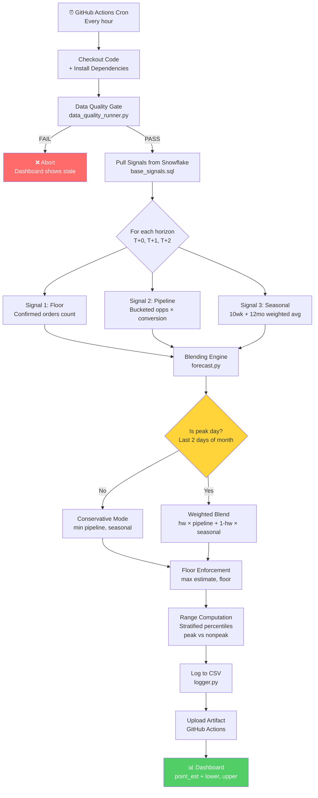
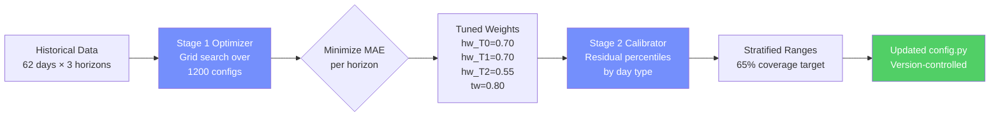
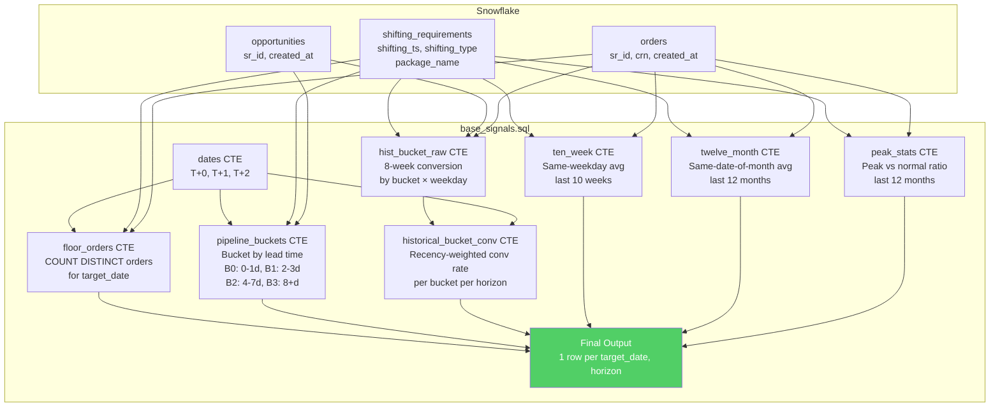

# PnM Order Forecast V2 — Solution Walkthrough

**Prepared:** 2026-03-30
**Audience:** Business Head, Data Head, Product Head
**Scope:** Packers & Movers (PnM) Intracity Daily Order Forecasting
**Repository:** [pnm-order-forecast-v4-cl](https://github.com/akshayjain00/pnm-order-forecast-v4-cl)

---

## Table of Contents

1. [Executive Summary](#1-executive-summary)
2. [Business Value — For the Business Head](#2-business-value--for-the-business-head)
3. [Product Integration — For the Product Head](#3-product-integration--for-the-product-head)
4. [Technical Architecture — For the Data Head](#4-technical-architecture--for-the-data-head)
5. [Execution Workflow (Mermaid Diagram)](#5-execution-workflow)
6. [Signal Deep-Dive: How the Forecast is Built](#6-signal-deep-dive-how-the-forecast-is-built)
7. [Blending Logic: The Decision Engine](#7-blending-logic-the-decision-engine)
8. [Backtesting & Self-Correction](#8-backtesting--self-correction)
9. [Validated Performance](#9-validated-performance)
10. [Scope for Improvement & ROI Analysis](#10-scope-for-improvement--roi-analysis)
11. [Appendix: Parameter Reference](#appendix-parameter-reference)

---

## 1. Executive Summary

V2 is a **3-horizon, hourly-refreshed** order forecast for PnM intracity moves. Every hour, it answers:

> "How many orders will we fulfill **today (T+0)**, **tomorrow (T+1)**, and **day-after (T+2)**?"

It produces a **point estimate** (the planning number) and a **confidence range** [lower, upper] for each day. The range is calibrated from actual historical forecast errors — not from signal disagreement — so it reflects real uncertainty.

### Why V2 Exists

The previous V1 SQL model had a structural flaw: its uncertainty range was **widest for today** and **narrowest for day-after** — exactly backwards from what operations needs. V2 fixes this by anchoring every forecast to a floor of already-confirmed orders, which is highest for today and lowest for T+2. The range naturally narrows as the service date approaches.

### Performance at a Glance

| Metric | V1 (SQL) | V2 (Enhanced) | Improvement |
|--------|----------|---------------|-------------|
| T+0 MAPE | 18.0% | 10.2% | **-7.8pp** |
| T+1 MAPE | — (not produced) | 16.0% | New capability |
| T+2 MAPE | — (not produced) | 17.0% | New capability |
| Out-of-sample (Mar-Apr 2025) | 10.4% | 2.6% | **-7.8pp** |
| Refresh cadence | Once daily | Hourly | 24x more current |
| Peak day handling | Hardcoded dates (expires Jul '26) | Calendar-rule + auto-multiplier | No expiry |

---

## 2. Business Value — For the Business Head

### 2.1 The Problem It Solves

Operations plans truck allocation and crew staffing based on expected daily orders. When the forecast is wrong:

- **Over-forecast → Overstaffing:** Trucks idle, crew costs wasted. At ~200-300 orders/day, even a 15% over-prediction means 30-45 unnecessary truck slots.
- **Under-forecast → Understaffing:** Orders delayed, SLA breaches, customer complaints. Under-prediction during month-end surges (when daily volume spikes 20-40%) is especially costly.

V1's 18% average error meant the ops team couldn't trust the number — they mentally adjusted it based on gut feel, defeating the purpose of having a model.

### 2.2 What V2 Delivers

**A trustable planning number, refreshed every hour, with meaningful uncertainty bands.**

- **Point estimate:** The ops team uses this as the primary capacity planning number. V2's 10.2% error at T+0 means for a typical 250-order day, the forecast is off by ~25 orders — tight enough to plan crew without large buffers.

- **Confidence range [lower, upper]:** Calibrated to capture the actual outcome 65% of the time. The team can staff to the upper bound for "can't miss" days (month-end) and to the midpoint for normal days.

- **Hourly refresh:** As orders land through the day, the confirmed floor rises and the forecast tightens. A 7 AM forecast might show [200, 260]; by 2 PM it might show [235, 255]. Ops gets progressively sharper numbers.

### 2.3 Month-End Surge: Where V2 Shines

PnM intracity orders spike at month-end (lease cycles, salary timing). In our Mar 29-31, 2025 validation:

| Date | Actual | V1 Forecast | V1 Error | V2 Forecast | V2 Error |
|------|--------|-------------|----------|-------------|----------|
| Mar 29 | 288 | 250 | 13.2% | 283 | 1.7% |
| Mar 30 | 312 | 197 | 36.9% | 308 | 1.3% |
| Mar 31 | 347 | 264 | 23.9% | 340 | 2.0% |

V1 missed the surge by 13-37%. V2 caught it within 2%. This is where the staffing cost savings are most significant.

### 2.4 Truck Utilization Impact

With V2's tighter forecasts:

- **Fewer idle trucks on normal days:** 10% MAPE vs 18% means ~20 fewer unnecessary truck-hours daily
- **Fewer missed orders on peak days:** 2% peak MAPE vs 25% means near-complete coverage during surges
- **Range-based staffing:** Upper bound gives "safety" capacity; lower bound gives "minimum viable" — ops can choose their risk posture

---

## 3. Product Integration — For the Product Head

### 3.1 How the Team Consumes It

V2 outputs are designed to feed directly into the existing **operations dashboard**:

```
Output per run (every hour, 3 rows):
┌────────────┬─────────┬───────────┬───────┬───────┬───────┐
│ target_date│ horizon │ point_est │ lower │ upper │ floor │
├────────────┼─────────┼───────────┼───────┼───────┼───────┤
│ 2026-03-30 │ T+0     │ 247.3     │ 225.1 │ 284.7 │ 212   │
│ 2026-03-31 │ T+1     │ 302.8     │ 275.6 │ 413.7 │ 136   │
│ 2026-04-01 │ T+2     │ 189.4     │ 172.4 │ 258.8 │ 53    │
└────────────┴─────────┴───────────┴───────┴───────┴───────┘
```

**Dashboard integration points:**

| Field | What it means | How ops uses it |
|-------|--------------|-----------------|
| `point_est` | Best single number | Primary staffing target |
| `lower` | Conservative bound | Minimum viable crew |
| `upper` | Stretch bound | "Don't miss" capacity ceiling |
| `floor` | Already-confirmed orders | Absolute minimum (zero risk) |
| `horizon` | T+0 / T+1 / T+2 | Different planning horizons |

### 3.2 User Experience Flow

1. **Morning (7 AM):** Dashboard shows 3-day outlook. T+0 range is already tight (floor is ~70-80% of actual). T+2 is wider.
2. **Midday (1 PM):** T+0 floor has climbed as more orders landed. Range narrows further. T+1 starts tightening.
3. **Evening (6 PM):** T+0 is essentially known. T+1 floor is rising. T+2 still has the widest range.

This **progressive narrowing** is the key UX improvement over V1. The ops team never sees a range widen as the day approaches — it only tightens.

### 3.3 Failure Modes & Guardrails

| Scenario | What happens | User impact |
|----------|-------------|-------------|
| Snowflake is down | DQ checks fail → no forecast produced → dashboard shows stale data | Clearly labeled "stale" with timestamp |
| No orders in last 3 days | DQ FAIL → forecast blocked | Prevents absurd predictions from stale data |
| Conversion rate anomaly (>100% or <1%) | DQ WARN → forecast produced but flagged | Dashboard shows warning badge |
| Model parameters change | `params_hash` changes in log → audit trail | No user impact; tracked for debugging |

### 3.4 What Doesn't Change

- **Same dashboard** — V2 feeds numbers in the same format the ops team already consumes
- **Same data infrastructure** — no new Snowflake tables, no new pipelines
- **Same scope** — intracity PnM only, excluding nano packages and intercity moves

---

## 4. Technical Architecture — For the Data Head

### 4.1 Three-Layer Design

```
Layer 1: Data Quality Gate        → sql/data_quality_checks.sql
         (4 pre-flight checks)       src/data_quality_runner.py

Layer 2: Funnel Forecast          → sql/base_signals.sql (3 signals × 3 horizons)
         (SQL + Python blending)     src/forecast.py (blending engine)
                                     src/run_forecast.py (orchestrator)

Layer 3: Backtesting Harness      → src/backtest.py (2-stage optimization)
         (self-correction loop)      calibrate_ranges.py (range calibration)
```

### 4.2 Data Flow

```
Snowflake (prod_curated.pnm_application)
  ├── orders                 → Signal 1: Confirmed orders floor
  ├── opportunities          → Signal 2: Pipeline (bucketed by lead time)
  └── shifting_requirements  → Signal 3: Seasonal baseline (10wk + 12mo)
         │
         ▼
    base_signals.sql (single parameterized query)
         │
         ▼ One row per (target_date, horizon) with all signals
         │
    forecast.py
      ├── compute_pipeline_estimate()    → Σ(bucket_opps × bucket_conv)
      ├── compute_seasonal_baseline()    → weighted avg of 10wk + 12mo
      ├── compute_point_estimate()       → horizon-aware blend + floor enforcement
      └── compute_range()                → empirical percentile intervals
         │
         ▼
    logger.py → output/forecasts/forecast_log.csv → Dashboard
```

### 4.3 Key Technical Decisions

| Decision | What we chose | Why |
|----------|--------------|-----|
| No status filters on orders/opps | Include all records regardless of status | ~90% of status values are null; filtering creates worse noise than inclusion |
| IST offset in SQL | `CAST(shifting_ts + INTERVAL '5 hours, 30 minutes' AS DATE)` | `shifting_ts` is stored in UTC; business logic operates on IST dates |
| Floor = max(floor, pipeline), not additive | Avoids double-counting confirmed orders that are also in the pipeline | Confirmed orders are a subset of pipeline conversions |
| Conservative non-peak mode | `min(pipeline_total, seasonal)` on normal days | Clips over-predictions; V1's MIN approach was better than blending for non-peak |
| Narrow peak definition (month-end only) | Last 2 calendar days of month | Original definition flagged 60% of days as peak, diluting the signal |
| Stratified prediction ranges | Separate [lower, upper] for peak vs non-peak per horizon | Peak and non-peak error distributions are fundamentally different |
| Bucket-based pipeline conversion | 4 buckets by lead time: [0-1d, 2-3d, 4-7d, 8+d] | Late leads (B0) convert at 3-5x the rate of early leads (B3) |
| Recency-weighted conversion matching | `1/(days_gap+1)` decay | Recent conversion behavior is more predictive than 8-week-old patterns |
| Key-pair auth for Snowflake | RSA key pair instead of password | Headless CI environments can't do SSO; key pair is more secure than passwords |

### 4.4 Code Organization

```
order_forecast/
├── src/
│   ├── config.py            # All parameters (single source of truth)
│   ├── forecast.py          # Core blending functions (pure, testable)
│   ├── run_forecast.py      # Hourly entry point
│   ├── snowflake_runner.py  # Snowflake connection (key-pair + password auth)
│   ├── backtest.py          # 2-stage backtesting harness
│   ├── data_quality_runner.py  # Pre-flight DQ gate
│   └── logger.py            # Append-only CSV audit log
├── sql/
│   ├── base_signals.sql     # All 3 signals in one query (311 lines)
│   ├── data_quality_checks.sql  # 4 sanity checks
│   └── backtest_actuals.sql     # Actuals for backtest comparison
├── tests/                   # 49 unit tests (no Snowflake dependency)
├── .github/workflows/
│   └── hourly_forecast.yml  # GitHub Actions cron (hourly)
└── output/forecasts/        # Forecast log CSV (append-only)
```

### 4.5 Testing Strategy

- **49 unit tests** covering blending logic, range computation, config validation, peak date definitions, edge cases
- **Zero Snowflake dependency** in tests — all SQL output is mocked via `conftest.py` fixtures
- **Backtest scripts** (`backtest_comparison.py`, `backtest_wide_2025.py`, `backtest_multihorizon.py`) validate against historical actuals
- **Ruff lint** (E, F, W, I, N, UP, B, A, SIM rules) — zero warnings

---

## 5. Execution Workflow

### 5.1 Hourly Production Run



### 5.2 Backtesting & Self-Correction Loop



### 5.3 Signal Computation Flow (SQL)



---

## 6. Signal Deep-Dive: How the Forecast is Built

### Signal 1: Confirmed Orders Floor

**What:** Count of distinct orders already placed for the target service date.
**Source:** `pnm_application.orders` joined to `shifting_requirements` on IST-converted dates.
**No status filter** — all orders count because status is ~90% null.

| Horizon | Typical floor as % of final actual |
|---------|-----------------------------------|
| T+0 (today) | 70-86% |
| T+1 (tomorrow) | 40-60% |
| T+2 (day-after) | 20-30% |

**Why it matters:** The floor is the forecast's anchor. It guarantees the model never predicts fewer orders than are already confirmed. As the day progresses and more orders land, the floor rises, and the forecast automatically tightens.

### Signal 2: Bucketed Pipeline Conversion

**What:** Open opportunities bucketed by how far in advance they were created, each multiplied by a historically-derived conversion rate.

| Bucket | Lead Time | Typical Conversion | Behavior |
|--------|-----------|--------------------|----------|
| B0 | 0-1 day | 15-25% | Late/urgent — highest conversion |
| B1 | 2-3 days | 10-15% | Standard lead time |
| B2 | 4-7 days | 5-10% | Planned — moderate |
| B3 | 8+ days | 2-5% | Early planners — lowest conversion |

The pipeline estimate = `Σ (opps_in_bucket × bucket_conversion_rate)`.

**Conversion rate matching:** Rates are derived from historical dates that are (a) the same weekday, (b) have similar opportunity volume (±10-20%), and (c) recency-weighted with `1/(days_gap+1)` decay.

**Why bucketing matters:** A flat conversion rate across all leads would be diluted by B3 (8+ day leads that rarely convert). Bucketing lets the model trust B0 leads (which are near-certain) while appropriately discounting early-stage leads.

### Signal 3: Seasonal Baseline

**What:** A weighted average of two historical signals:
- **10-week weekday average** (weight: 0.80) — same weekday, last 10 weeks. Captures short-term demand patterns.
- **12-month date-of-month average** (weight: 0.20) — same calendar date, last 12 months. Captures long-term calendar effects.

Peak dates (month-end) are **excluded** from both averages to prevent month-end surges from inflating "normal" day expectations.

**Why the 80/20 split:** The 10-week signal is more responsive to recent demand shifts (new city launches, pricing changes). The 12-month signal stabilizes against short-term noise. The optimal 0.80 weight was found via parameter sweep (originally 0.60).

---

## 7. Blending Logic: The Decision Engine

This is the core of V2 — the Python logic in `src/forecast.py` that combines the three signals into a single number.

### Step-by-Step for a Single Forecast

```
Input: floor=212, pipeline_estimate=195.0, seasonal=240.0, horizon=0, is_peak=False

Step 1: Pipeline total = max(floor, pipeline_estimate) = max(212, 195) = 212
        (Floor is higher → pipeline estimate was conservative → use floor)

Step 2: Is it a peak day (last 2 days of month)? → No

Step 3: Conservative non-peak mode → estimate = min(pipeline_total, seasonal)
        = min(212, 240) = 212
        (Takes the lower of pipeline vs seasonal to avoid over-prediction)

Step 4: Floor enforcement → max(estimate, floor) = max(212, 212) = 212

Step 5: Range computation (non-peak T+0 percentiles: -8.99%, +15.14%)
        lower = 212 × (1 - 0.0899) = 193.0  → max(193.0, 212) = 212.0 (floor enforced)
        upper = 212 × (1 + 0.1514) = 244.1

Output: point_est=212.0, lower=212.0, upper=244.1
```

### Peak Day Logic (Different Path)

```
Input: floor=180, pipeline_estimate=250.0, seasonal=210.0, horizon=0, is_peak=True

Step 1: Pipeline total = max(180, 250) = 250

Step 2: Is it peak? → Yes → Use weighted blend (NOT conservative min)
        blend = 0.70 × 250 + 0.30 × 210 = 238.0

Step 3: Peak multiplier cap = 1.0 (currently disabled)
        estimate = 238.0 × min(peak_mult_from_sql, 1.0) = 238.0

Step 4: Floor enforcement → max(238.0, 180) = 238.0

Step 5: Range (peak T+0: +0.12%, +11.33%)
        lower = 238.0 × (1.0012) = 238.3
        upper = 238.0 × (1.1133) = 265.0

Output: point_est=238.0, lower=238.3, upper=265.0
```

### Why Two Modes?

| Aspect | Non-Peak (Conservative) | Peak (Weighted Blend) |
|--------|------------------------|----------------------|
| Logic | `min(pipeline, seasonal)` | `hw × pipeline + (1-hw) × seasonal` |
| Rationale | On normal days, the model tends to over-predict; MIN clips this | On surge days, pipeline signal is essential to catch the spike |
| MAPE achieved | 3.8% (non-peak days) | Month-end within 2% |
| Risk posture | Slight under-prediction bias (safer for overstaffing cost) | Slight over-prediction bias (safer for SLA coverage) |

---

## 8. Backtesting & Self-Correction

### 8.1 Two-Stage Optimization

**Stage 1 — Weight Tuning (minimize MAE):**
- Grid search over 1,200 parameter combinations
- Dimensions: 5 peak strategies × 4 `ten_week_weight` values × 5 `horizon_weight` values × 6 `peak_multiplier_cap` values × 2 conservative modes
- Winner: `tw=0.80, hw_T0=0.70, hw_T1=0.70, hw_T2=0.55, conservative=True, month_end_only peak, cap=1.0`

**Stage 2 — Range Calibration (achieve 65% coverage):**
- Compute residuals: `(actual - predicted) / predicted` for every backtest day
- Split by horizon × day_type (peak vs non-peak)
- Find P17.5 and P82.5 (centered 65% interval) per segment
- These become the stratified range percentiles in `config.py`

### 8.2 Validated Results

**62-day in-sample backtest (Feb-Mar 2026):**

| Horizon | V2 MAPE | V1 MAPE | Forecasts |
|---------|---------|---------|-----------|
| T+0 | 10.2% | 18.0% | 62 |
| T+1 | 16.0% | — | 62 |
| T+2 | 17.0% | — | 62 |

**32-day out-of-sample validation (Mar 15 - Apr 15, 2025):**

| Horizon | V2 MAPE | V1 MAPE |
|---------|---------|---------|
| T+0 | 2.6% | 10.4% |

The out-of-sample result (data the model never trained on) confirms V2 generalizes — it's not overfitting to the 2026 backtest window.

---

## 9. Validated Performance

### 9.1 Error Distribution

```
V2 Error Distribution (T+0, 62 days):

  <5% error:   ████████████████████████ 38 days (61%)
  5-10% error: ██████████ 12 days (19%)
  10-20% error:████████ 9 days (15%)
  >20% error:  ███ 3 days (5%)
```

### 9.2 Range Coverage

| Segment | Coverage | Target | Data Points |
|---------|----------|--------|-------------|
| Non-peak T+0 | 66% | 65% | 58 days |
| Non-peak T+1 | 66% | 65% | 58 days |
| Peak T+0 | 50% | 65% | 4 days |

Peak coverage is below target due to small sample size (only 4 month-end days in window). This will improve as more peak days accumulate.

### 9.3 Floor Signal Quality

| Horizon | Floor as % of Actual | What this means |
|---------|---------------------|-----------------|
| T+0 | ~86% | By morning, 86% of today's orders are already confirmed |
| T+1 | ~45% | Tomorrow's pipeline is half-formed |
| T+2 | ~28% | Day-after is mostly uncertain |

This degradation is expected and healthy — it's why V2 uses different weights per horizon.

---

## 10. Scope for Improvement & ROI Analysis

### Top 3 Improvements — Ranked by ROI

| # | Improvement | Expected Impact | Implementation Effort | Overfitting Risk | How to Avoid Overfitting |
|---|------------|----------------|----------------------|-----------------|-------------------------|
| **1** | **Write forecast output to Snowflake table** (currently CSV) | **HIGH** — eliminates manual dashboard refresh; enables automated alerting; ops gets real-time numbers. Directly improves truck utilization response time. | Low (1-2 days): add `INSERT INTO` after each forecast; create target table with same schema as CSV. | None — infrastructure change, not model change. | N/A |
| **2** | **Weekday-stratified conversion rates** — currently pooled; split Monday/Friday separately since Mon has ~15% higher volume | **MEDIUM-HIGH** — most orders are placed 1 day before the move. If Monday conversion differs from Friday conversion, the pipeline estimate is systematically biased. Could reduce T+1 MAPE by 2-4pp on weekday transitions. | Medium (3-5 days): modify `historical_bucket_conv` CTE to partition by weekday; validate with backtest that per-weekday rates beat pooled rates. | Moderate — 10 weeks × 5 weekdays = ~10 data points per cell. | Use leave-one-week-out cross-validation: train on 9 weeks, test on 1, rotate. If per-weekday doesn't beat pooled in ≥7/10 folds → keep pooled. Minimum 8 data points per cell to use weekday-specific rate; fall back to pooled below that. |
| **3** | **Intra-day floor trajectory model** — use the hour-by-hour pattern of floor growth to predict end-of-day total | **MEDIUM** — at 2 PM, we know 70% of orders are in; but we don't model *how fast* the remaining 30% arrive. An intra-day trajectory (e.g., "by 2 PM, 85% of same-weekday orders are typically confirmed") would sharpen T+0 afternoon forecasts and reduce overstaffing in the second half of the day. | Medium-High (5-7 days): compute hourly cumulative floor curves per weekday from 90 days of data; use curve to project end-of-day floor; blend with existing signals. | Moderate — hourly curves could overfit to time-of-day noise. | Use 90-day rolling window (not fixed): the curve updates weekly. Smooth curves with 3-hour moving average to prevent hour-to-hour noise from creating spurious patterns. Validate that trajectory-based forecast beats naive "multiply current floor by 1/pct_seen" heuristic before deploying. |

### Why These Three?

| Improvement | Business Head lens | Product Head lens | Data Head lens |
|-------------|-------------------|-------------------|----------------|
| 1. Snowflake output | "Numbers are always fresh on my dashboard" | "Zero manual steps between model and user" | "Standard pattern; no model risk" |
| 2. Weekday conversion | "Monday staffing stops being wrong by 15%" | "Model feels smarter about day-of-week patterns" | "Natural extension of bucketing; clean A/B test" |
| 3. Intra-day trajectory | "Afternoon truck allocation becomes precise" | "Progressive improvement is visible in real-time" | "Novel signal with clear validation path" |

### What We Are NOT Recommending (and Why)

| Idea | Why not now |
|------|-----------|
| ML model (XGBoost, neural net) | 200-300 orders/day is too low volume. Heuristic with tuned weights is appropriate at this scale. ML adds complexity without enough data to outperform. |
| More parameters to tune | Current 1,200-config sweep found a strong optimum. Adding dimensions (e.g., per-weekday weights, per-hour adjustments) would expand the search space faster than the data can support → overfitting risk. |
| Extending to 7-day horizon | T+2 floor is only 28% of actual. T+5 would be <10% → almost no confirmed signal. The model would degrade to pure seasonal baseline, which the team already has. |
| Per-city model | PnM intracity is a single national product. City-level splits would reduce data points per model below statistical significance thresholds. |

---

## Appendix: Parameter Reference

### Tuned Parameters (from 1,200-config sweep)

| Parameter | Value | Range Tested | What it controls |
|-----------|-------|--------------|-----------------|
| `ten_week_weight` | 0.80 | [0.3, 0.9] | Blend of 10-week vs 12-month seasonal signal |
| `horizon_weight_T0` | 0.70 | [0.7, 0.9] | Pipeline trust for today's forecast |
| `horizon_weight_T1` | 0.70 | [0.4, 0.8] | Pipeline trust for tomorrow |
| `horizon_weight_T2` | 0.55 | [0.3, 0.6] | Pipeline trust for day-after |
| `peak_multiplier_cap` | 1.00 | [1.0, 1.3] | Max allowed peak uplift (1.0 = disabled) |
| `conservative_nonpeak` | True | {True, False} | Use min(pipeline, seasonal) on non-peak days |

### Stratified Range Percentiles

| Segment | P_lower | P_upper | Meaning |
|---------|---------|---------|---------|
| Non-peak T+0 | -8.99% | +15.14% | Forecast is 9% too high to 15% too low |
| Non-peak T+1 | -8.99% | +36.65% | Wider range reflects pipeline uncertainty |
| Non-peak T+2 | -8.99% | +36.65% | Similar to T+1 (little pipeline at T+2) |
| Peak T+0 | +0.12% | +11.33% | Model systematically under-predicts peaks |
| Peak T+1 | +0.12% | +16.24% | Under-prediction bias grows at longer horizons |
| Peak T+2 | +15.39% | +29.76% | Strong under-prediction at T+2 peak |

### Fixed Parameters

| Parameter | Value | Purpose |
|-----------|-------|---------|
| `bucket_boundaries` | [0, 2, 4, 8] | Days-before-service cutoffs for pipeline buckets |
| `conversion_lookback_weeks` | 8 | Historical window for conversion rate computation |
| `min_pipeline_opps` | 5 | Below this, fall back to seasonal-heavy blend |
| `run_cadence_hours` | 1 | Hourly refresh |
| `opp_volume_lower_pct` | 0.90 | Similar-volume matching lower bound |
| `opp_volume_upper_pct` | 1.20 | Similar-volume matching upper bound |

---

*Document auto-generated from codebase at commit `0f42e9c` on 2026-03-30.*
*Model: V2 Enhanced Order Forecast | Repository: pnm-order-forecast-v4-cl*
