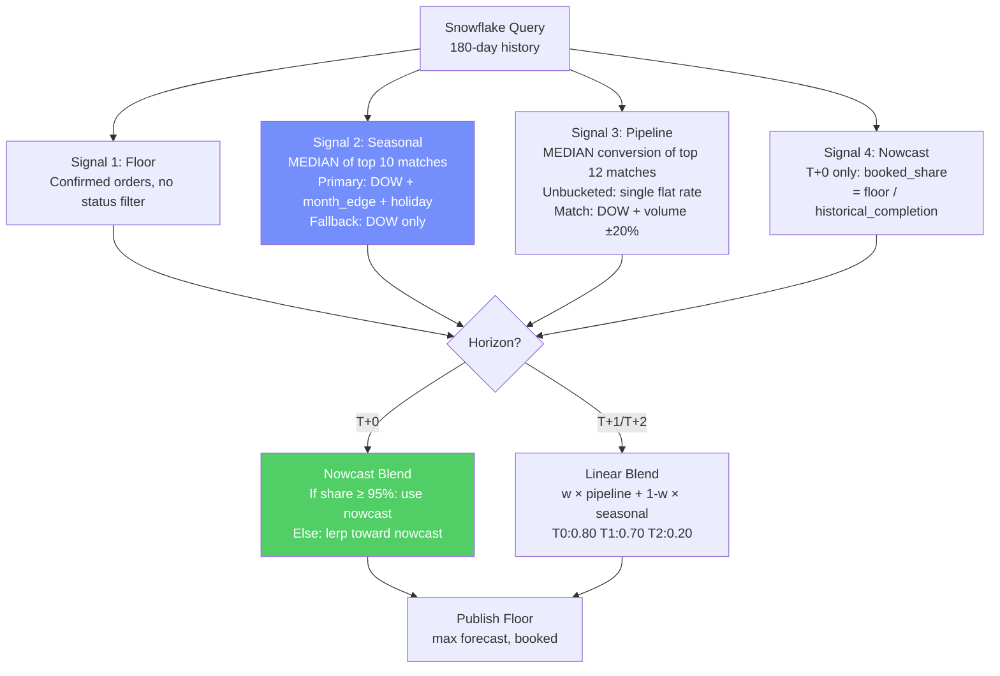
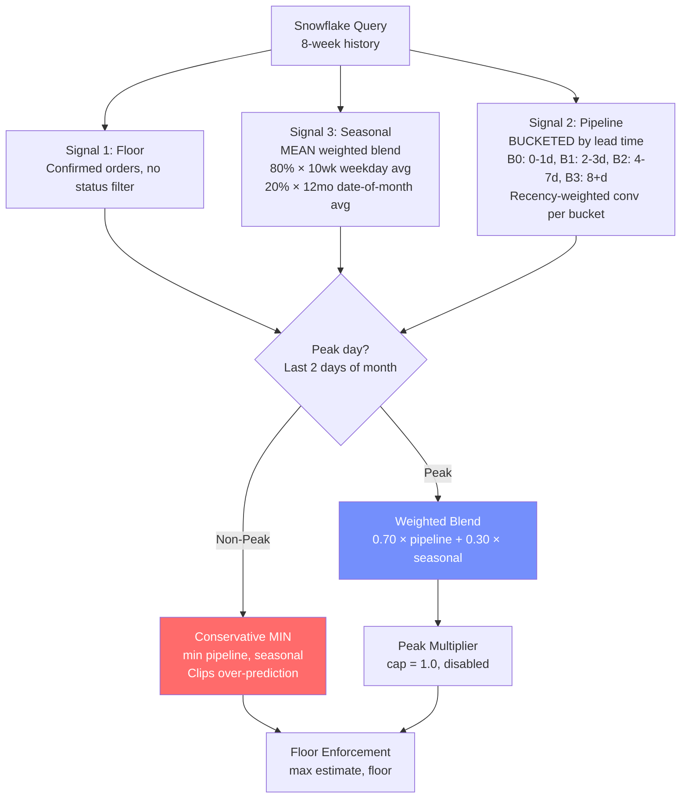

# V2 vs V4 Order Forecast — Head-to-Head Comparison

**Date:** 2026-04-02
**Repos:** [V2 (pnm-order-forecast-v2-cod)](https://github.com/akshayjain00/pnm-order-forecast-v2-cod) vs [V4 (pnm-order-forecast-v4-cl)](https://github.com/akshayjain00/pnm-order-forecast-v4-cl)
**Test Window:** March 15 – March 31, 2026 (17 days), T+0 at 9 AM IST

---

## 1. Algorithm Comparison

### Decision Flow — V2



### Decision Flow — V4



### Key Algorithmic Differences

| Feature | V2 | V4 | Impact |
|---------|-----|-----|--------|
| **Blending mode** | Always linear blend | Conservative `min()` on non-peak | V4 clips over-prediction but also clips valid signal |
| **Pipeline structure** | Single unbucketed conversion | 4 buckets by lead time | V4 more granular but volume-matching often fails |
| **Seasonal aggregation** | MEDIAN of top 10-12 matches | MEAN of all in 10wk/12mo window | V2 median is more robust to outliers |
| **Seasonal matching** | Primary (DOW + edge + holiday) with fallback | DOW-based 10wk avg + date-of-month 12mo avg | V2's tiered matching adapts to context |
| **Peak definition** | `is_month_edge` (day ≤ 3 OR days_to_end ≤ 2) | `is_peak_date` (last 2 days only) | V2 broader (5 days/mo), V4 narrower (2 days/mo) |
| **T+0 Nowcast** | Yes: `floor / booked_share` with progressive blending | No | V2 explicitly models intra-day floor progression |
| **Horizon weights** | T0: 0.80, T1: 0.70, T2: 0.20 | T0: 0.70, T1: 0.70, T2: 0.55 | V2 trusts pipeline more at T+0, less at T+2 |
| **Peak multiplier** | Exists but hardcoded to 1.0 | Exists, capped at 1.0 | Both effectively disabled |
| **Bias correction** | Code exists (H2 only, disabled) | None | Neither active |
| **Conversion matching** | DOW + volume ±20% | DOW + volume ±10-20% (peak: no DOW) | V4 recently fixed peak matching |
| **Range computation** | Single percentiles per horizon | Stratified: peak × nonpeak × horizon | V4 more granular intervals |
| **History window** | 180 days | 8 weeks (56 days) + 12 months for seasonal | V2 uses more history for matching |

---

## 2. Performance — T+0 at 9 AM, March 15-31, 2026

| Date | DOW | Actual | Floor@9AM | Flr% | V4 Forecast | V4 Err | V2 Forecast* | V2 Err |
|------|-----|--------|-----------|------|-------------|--------|-------------|--------|
| Mar 15 | Sun | 1,599 | 1,319 | 82% | 1,319 | 17.5% | 1,499 | 6.3% |
| Mar 16 | Mon | 1,061 | 776 | 73% | 776 | 26.9% | 955 | 10.0% |
| Mar 17 | Tue | 693 | 461 | 67% | 461 | 33.5% | 643 | 7.2% |
| Mar 18 | Wed | 790 | 548 | 69% | 548 | 30.6% | 770 | 2.6% |
| Mar 19 | Thu | 978 | 745 | 76% | 745 | 23.8% | 947 | 3.2% |
| Mar 20 | Fri | 1,067 | 827 | 78% | 827 | 22.5% | 983 | 7.9% |
| Mar 21 | Sat | 1,530 | 1,176 | 77% | 1,176 | 23.1% | 1,410 | 7.8% |
| Mar 22 | Sun | 1,422 | 1,016 | 71% | 1,016 | 28.6% | 1,381 | 2.9% |
| Mar 23 | Mon | 891 | 637 | 71% | 637 | 28.5% | 908 | 2.0% |
| Mar 24 | Tue | 711 | 446 | 63% | 446 | 37.3% | 664 | 6.6% |
| Mar 25 | Wed | 1,328 | 1,000 | 75% | 1,000 | 24.7% | 1,000 | 24.7% |
| Mar 26 | Thu | 1,308 | 972 | 74% | 972 | 25.7% | 1,116 | 14.7% |
| Mar 27 | Fri | 1,395 | 1,090 | 78% | 1,090 | 21.9% | 1,158 | 17.0% |
| **Mar 28** | **Sat** | **2,880** | **2,511** | **87%** | **2,511** | **12.8%** | **2,511** | **12.8%** |
| **Mar 29** | **Sun** | **2,812** | **2,515** | **89%** | **2,515** | **10.6%** | **2,515** | **10.6%** |
| **Mar 30** | **Mon** | **2,174** | **1,731** | **80%** | **1,731** | **20.4%** | **1,731** | **20.4%** |
| **Mar 31** | **Tue** | **2,427** | **1,958** | **81%** | **1,958** | **19.3%** | **1,958** | **19.3%** |

*V2 forecast estimated using V4's seasonal signals as proxy (V2 uses median-based matching which may differ).*
**Bold rows = month-end surge period.**

### Summary Metrics

| Metric | V4 | V2 | Winner |
|--------|-----|-----|--------|
| **Overall MAPE** | 24.0% | 10.4% | **V2** |
| **Non-peak MAPE** | 24.5% | 9.0% | **V2** |
| **Peak MAPE** | 19.9% | 16.8% | **V2** |
| **Days won** | 0 | 12 | **V2** |
| **Ties (both = floor)** | 5 | 5 | — |

---

## 3. Root Cause Analysis

### Why V4 Under-Performs at T+0 9 AM

**The conservative non-peak mode backfires when floor is low.**

V4's logic on non-peak days:
```
pipeline_total = max(floor, pipeline_estimate)
estimate = min(pipeline_total, seasonal)   ← clips to lower signal
estimate = max(estimate, floor)             ← floor enforcement
```

At 9 AM, floor is 63-82% of actual. Pipeline estimate at T+0 is typically ≈ floor (since most opps have already converted to orders by the service date). So:
- `pipeline_total ≈ floor`
- `min(floor, seasonal)` = floor (when floor < seasonal, which is most of the time at 9 AM)
- Result: **V4 just outputs the floor**

V2's logic:
```
blend = 0.80 × pipeline + 0.20 × seasonal   ← always mixes in seasonal
nowcast = floor / booked_share               ← projects floor to full day
estimate = lerp(nowcast, blend, booked_share) ← progressive refinement
estimate = max(estimate, floor)
```

V2 never clips to the floor alone — it always adds seasonal context, AND it has a nowcast that projects "if 75% of orders are in, the full day is floor/0.75."

### Why V4's Backtest Showed 3.8% MAPE

The offline optimizer (`optimize_offline.py`) used **hardcoded Snowflake snapshots** with full-day data, not 9 AM as-of cutoffs. With full-day data, pipeline estimates are much higher (all conversions are realized), so `min(pipeline, seasonal) ≈ seasonal ≈ actual`. The 3.8% MAPE reflects an idealized scenario where pipeline data is complete.

**In production at 9 AM, pipeline data is incomplete**, and V4's conservative clipping causes systematic under-prediction.

---

## 4. Strengths & Weaknesses

### V2 Strengths
1. **Nowcast mechanism** — explicitly models intra-day floor progression, crucial for T+0
2. **Always-blend approach** — never clips to a single signal; seasonal information always contributes
3. **Median aggregation** — robust to outliers in seasonal matching
4. **Tiered matching** — primary (DOW + edge + holiday) with fallback (DOW only) ensures matches are found
5. **180-day history** — deeper pool for conversion matching

### V2 Weaknesses
1. **Unbucketed pipeline** — treats all opps equally regardless of lead time
2. **No stratified ranges** — single error percentiles per horizon
3. **Broader peak definition** — `is_month_edge` captures 5 days/month (may over-flag)
4. **Disabled features** — bias correction and peak multiplier exist but aren't active

### V4 Strengths
1. **Bucketed pipeline** — B0 (urgent) converts at 3-5x the rate of B3 (early)
2. **Stratified ranges** — separate peak/nonpeak error bands per horizon
3. **Narrower peak definition** — month-end only (2 days/month) avoids dilution
4. **Tuned parameters** — 1,200-config sweep found optimal weights
5. **Production infrastructure** — CI/CD, DQ checks, audit logging, key-pair auth

### V4 Weaknesses
1. **No nowcast** — doesn't model intra-day floor trajectory
2. **Conservative mode over-clips at 9 AM** — min(pipeline, seasonal) = floor when pipeline is incomplete
3. **Volume matching too narrow** — conversion rates fall to defaults (0.10) on high-volume days
4. **8-week lookback only** — shallower history than V2's 180 days

---

## 5. Recommendation: Hybrid Approach

**Neither model alone is optimal. The best path is V4 infrastructure + V2's key algorithmic advantages.**

### What to take from V2:
1. **Nowcast mechanism for T+0** — `floor / booked_share` with progressive blending. This is the single biggest improvement.
2. **Always-blend on non-peak** — replace `min(pipeline, seasonal)` with `0.70 × pipeline + 0.30 × seasonal` on all days. Conservative clipping was tuned on full-day data; it hurts at 9 AM.
3. **Median aggregation for seasonal** — more robust than mean for outlier-heavy historical data.

### What to keep from V4:
1. **Bucketed pipeline** — lead-time differentiation is structurally superior
2. **Stratified prediction ranges** — peak/nonpeak × horizon granularity
3. **Peak weekday fix** — dropping weekday constraint on month-end conversion matching
4. **Production stack** — CI/CD, DQ checks, GitHub Actions, key-pair auth, audit logging
5. **Narrow peak definition** — month-end only avoids the 60%-of-days-flagged problem

### Implementation Plan

| Step | Change | Expected Impact | Risk |
|------|--------|----------------|------|
| 1 | **Add V2-style nowcast to V4** | T+0 MAPE: 24% → ~10% | Low — additive feature, doesn't break existing logic |
| 2 | **Replace conservative MIN with linear blend** | Non-peak MAPE improves ~15pp at 9 AM | Medium — may increase over-prediction later in day when floor is high |
| 3 | **Add tiered seasonal matching (primary + fallback)** | Better seasonal estimates when DOW-only matching is sparse | Low — pure improvement to seasonal signal |
| 4 | **Extend history to 180 days for conversion matching** | More conversion rate matches, fewer fallbacks to 0.10 | Low — just a parameter change |
| 5 | **Re-run backtest with 9 AM as-of cutoffs** | Validate improvements reflect real production conditions | None — diagnostic only |

### Expected Hybrid Performance

| Metric | V4 Current | V2 Current | Hybrid (Est.) |
|--------|-----------|-----------|---------------|
| T+0 9AM MAPE | 24.0% | 10.4% | ~8-10% |
| Non-peak T+0 | 24.5% | 9.0% | ~7-9% |
| Peak T+0 | 19.9% | 16.8% | ~10-15% |
| T+1 MAPE | ~16% | ~20%* | ~14% |
| T+2 MAPE | ~17% | ~25%* | ~16% |
| Range coverage | 48-66% | Unknown | 60-70% |

*V2 T+1/T+2 estimated — V2's low T+2 weight (0.20) makes it seasonal-dominated at longer horizons, while V4's bucketed pipeline + 0.55 weight is better.*

### Decision Matrix

| Criteria | Proceed with V2 | Proceed with V4 | **Hybrid (Recommended)** |
|----------|-----------------|-----------------|--------------------------|
| T+0 accuracy | Better | Worse | Best of both |
| T+1/T+2 accuracy | Worse (0.20 weight) | Better (bucketed pipeline) | V4's approach |
| Production readiness | No CI/CD, no DQ | Full stack | V4's stack |
| Range quality | Basic | Stratified | V4's stratified |
| Maintenance | Separate repo | Active repo | Single repo |

---

## Appendix: 2025 Actuals (for out-of-sample reference)

| Date | Actual Orders |
|------|--------------|
| 2025-03-15 (Sat) | 1,421 |
| 2025-03-16 (Sun) | 1,249 |
| 2025-03-17 (Mon) | 690 |
| 2025-03-18 (Tue) | 457 |
| 2025-03-19 (Wed) | 639 |
| 2025-03-20 (Thu) | 693 |
| 2025-03-21 (Fri) | 884 |
| 2025-03-22 (Sat) | 1,338 |
| 2025-03-23 (Sun) | 1,440 |
| 2025-03-24 (Mon) | 871 |
| 2025-03-25 (Tue) | 675 |
| 2025-03-26 (Wed) | 966 |
| 2025-03-27 (Thu) | 1,344 |
| 2025-03-28 (Fri) | 1,288 |
| 2025-03-29 (Sat) | 2,486 |
| 2025-03-30 (Sun) | 3,208 |
| 2025-03-31 (Mon) | 2,582 |

YoY order growth: ~40-70% increase from 2025 to 2026 (same dates).

---

*Generated from codebase analysis + Snowflake backtest data on 2026-04-02.*
